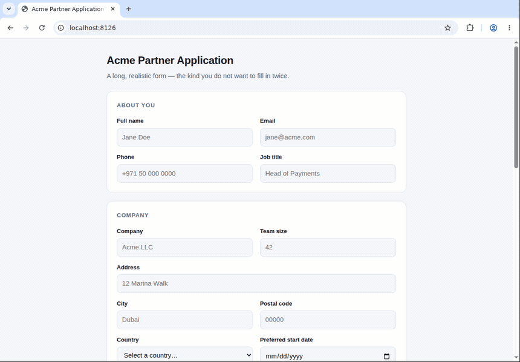
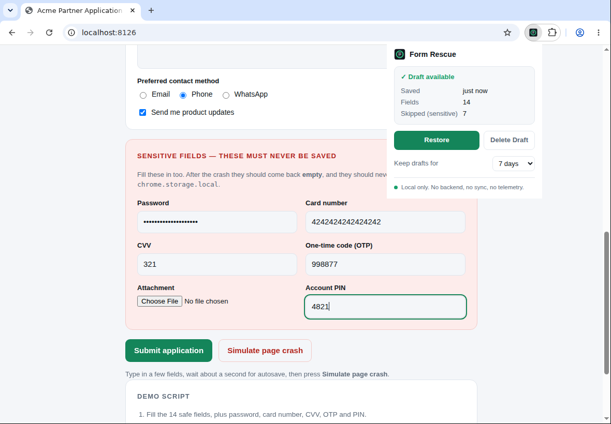
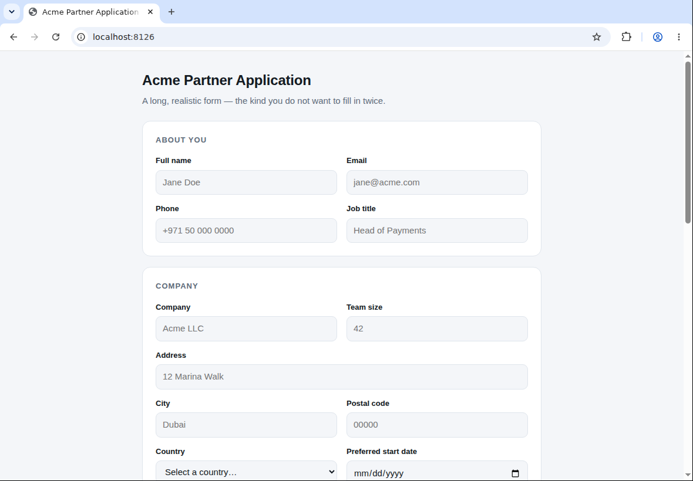
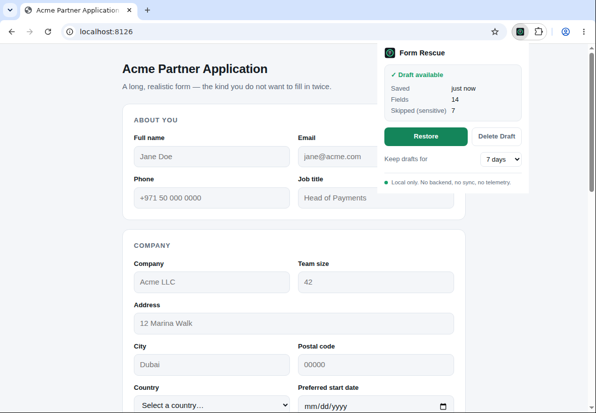
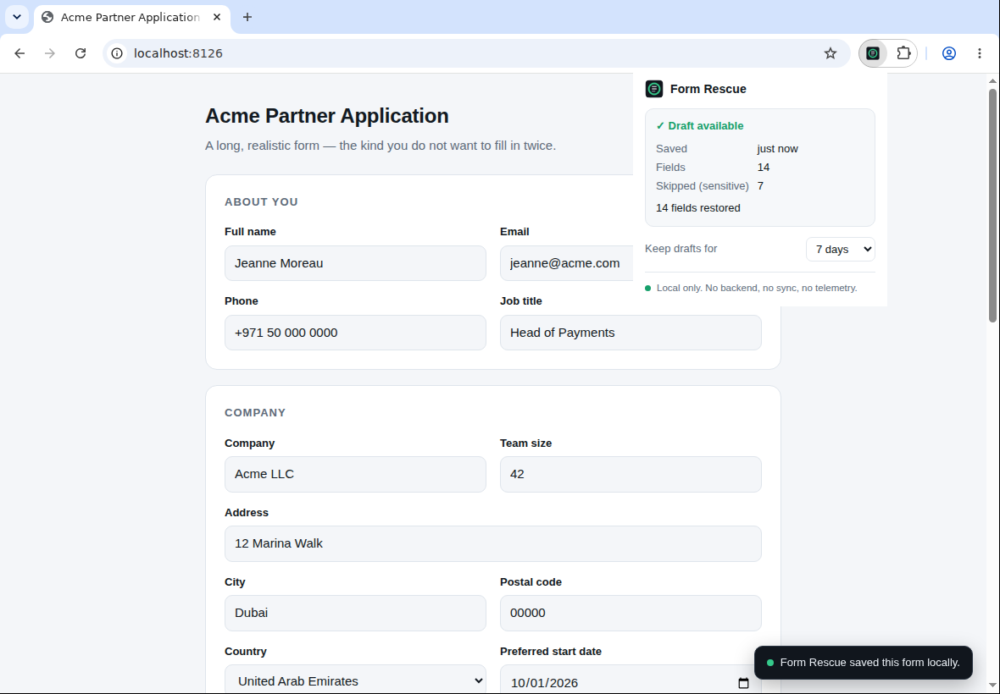
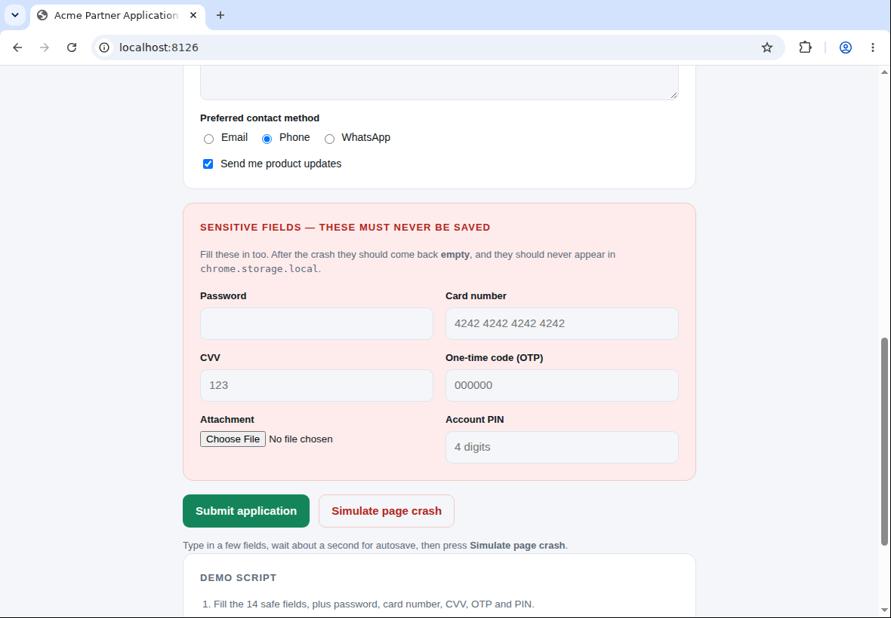

# Form Rescue

[](https://github.com/VsevaTech/form-rescue/actions/workflows/ci.yml)

**Never lose a long web form again.** Form Rescue locally saves safe form fields and lets you
restore them after a reload, crash or expired session.

You spend twenty minutes on an application form. The session expires, the tab closes, the page
reloads — and everything is gone. Form Rescue keeps a local draft of the fields that are safe to
keep, and puts them back when you ask it to.

```
Fill  →  Crash  →  Restore
```



It is a browser extension, not a service. There is no backend, no account and no sync.

---

## Features

- **Autosave while you type** — debounced, so storage is written once you pause, not once per keystroke.
- **Explicit restore** — nothing is ever put back without you pressing **Restore**.
- **Aggressive sensitive-field filtering** — passwords, card numbers, CVV, OTP, PINs, tokens and
  API keys are never written to storage at all.
- **Per-page drafts** — keyed by `origin + pathname`, so two forms on the same site never collide.
- **Safe restore** — a field that cannot be matched with confidence is skipped rather than guessed at.
- **TTL** — drafts expire after 7 days by default (1 / 7 / 30 configurable in the popup).
- **Local only** — `chrome.storage.local`, nothing else. No network code in the extension.

## Installation

Form Rescue is not on the Chrome Web Store. Build it and load it unpacked:

```bash
git clone https://github.com/VsevaTech/form-rescue.git
cd form-rescue
npm install
npm run build
```

Then, in Chrome or any Chromium browser:

1. Open `chrome://extensions`
2. Turn on **Developer mode** (top right)
3. Click **Load unpacked**
4. Select the `dist/` folder inside the repository

The Form Rescue icon appears in the toolbar. **Alt+Shift+F** opens the popup too.

## Demo

The repository ships with a realistic 20-field application form, including deliberately sensitive
fields, so you can watch the privacy guarantee hold.

```bash
npm run build      # if you have not already
npm run demo       # serves demo/ on http://localhost:8000
```

Then:

1. Open <http://localhost:8000> and fill in the 14 safe fields.
2. Fill in **Password**, **Card number**, **CVV**, **OTP** and **Account PIN** too.
3. Wait about a second. Open Form Rescue — it reports **Draft available, 14 fields**.

   

4. Press **Simulate page crash**. The form is wiped and the page is reloaded from scratch.

   

5. Open Form Rescue again — the draft survived.

   

6. Press **Restore**.

   

The 14 safe fields come back. The sensitive ones stay empty, because they were never saved.



The demo page is served over HTTP rather than opened from disk because the extension only injects
into `http://` and `https://` pages.

## How it works

```
src/
├── content/
│   ├── index.ts      content script entry: wiring and messaging
│   ├── autosave.ts   debounced snapshot writer
│   ├── restore.ts    applies a draft back onto the page
│   ├── fields.ts     discovery, identification, value access
│   ├── sensitive.ts  the "never save this" rules
│   └── indicator.ts  small "saved locally" toast
├── popup/            popup UI (plain TypeScript, no framework)
├── storage/drafts.ts chrome.storage.local access, TTL, page keys
├── background/       service worker: housekeeping only
└── manifest.json

scripts/
├── build.mjs             three IIFE bundles + static assets -> dist/
├── make-icons.mjs        draws the toolbar icons (no binary assets in git)
├── serve-demo.mjs        static server for demo/
├── verify-extension.mjs  loads dist/ in a real Chromium and runs the demo
├── capture-docs.mjs      produces the README screenshots and GIF
└── e2e/harness.mjs       shared browser harness
```

Detection, storage, restore and the popup are separate modules; the content script is wiring, not
a monolith.

1. A content script runs on `http(s)` pages and listens for `input` and `change`.
2. Events are debounced (700 ms). On the trailing edge, the page is walked and every **safe**
   control is collected. Sensitive controls are dropped at this point — they never reach the
   storage layer.
3. The snapshot is written to `chrome.storage.local` under `draft:<origin><pathname>`.
4. When you press **Restore**, the popup messages the content script, which locates each stored
   field again and writes the value back, firing `input` and `change` so page scripts notice.

### Field identification

A short fallback chain, tried in order:

```
unique id  →  name (scoped to its form, disambiguated by position)  →  short CSS selector
```

The selector fallback is capped at four ancestor steps and must anchor on a unique `id` or on the
document root. Anything longer is refused: a fragile structural selector is more likely to restore
a value into the *wrong* field than into the right one, and a missing value is a much smaller
problem than a misplaced one.

At restore time a field is written back only if the located element still exists, is still the same
kind of control, and is still considered safe. Otherwise it is counted as skipped.

## What is saved

| Control | Saved |
| --- | --- |
| `input[type=text]`, `email`, `tel`, `number`, `date`, `search`, `url` | value |
| `textarea` | value |
| `select` (single and multiple) | selected value(s) |
| `input[type=checkbox]` | checked state |
| `input[type=radio]` | value of the checked member of the group |

Empty values and disabled controls are not stored. Custom editors and `contenteditable` are out of
scope for this version.

## What Form Rescue NEVER stores

```
Passwords
PINs
OTP codes
Card numbers
CVV / CVC
Access tokens
API keys
File inputs
Hidden fields
```

Concretely, a control is excluded when any of the following holds:

- its type is `password`, `hidden`, `file` or `image`;
- its `autocomplete` is `current-password`, `new-password`, `one-time-code`, or any `cc-*` token
  (`cc-number`, `cc-csc`, `cc-exp`, …);
- its `name`, `id`, `autocomplete`, `placeholder`, `title`, `aria-label` or accessible label
  matches a sensitive pattern — `password`, `passwd`, `pwd`, `passcode`, `pin`, `otp`, `cvv`,
  `cvc`, `security code`, `card number`, `pan`, `credit card`, `access_token`, `refresh_token`,
  `authorization`, `secret`, `api_key`, `private_key`, and more.

Separator and case variants are normalised, so `cardNumber`, `card-number`, `card_number`,
`CARD NUMBER` and `cardnumber` are all caught by one rule. Short ambiguous words such as `pin` and
`pan` are matched as whole words only, so `shipping` and `company` are not falsely flagged.

The guiding rule is **when in doubt, do not save**. A field that looks even slightly sensitive is
skipped; the cost is retyping one field, and the alternative is a secret sitting in local storage.

### This is a heuristic, not a guarantee

Sensitive-field detection is based on field metadata and heuristics. A site that labels a card
number field `field_17` with no autocomplete attribute and no label will defeat it. **Form Rescue
is not a password manager and is not designed to hold secrets.** Treat it as a convenience for
long, ordinary forms.

## Privacy

Form Rescue has **no backend**. Drafts remain in local browser storage and are never uploaded by
the extension.

- No server, no API calls, no analytics, no telemetry, no remote logging.
- No external AI, no cloud sync — not even `chrome.storage.sync`.
- Query strings are excluded from the draft key, so session ids and one-time tokens in URLs never
  reach storage.
- The bundled code is not minified, so you can read exactly what ships.

You can check for yourself: open `chrome://extensions`, click **service worker** under Form Rescue,
and run

```js
await chrome.storage.local.get(null)
```

A real dump from the demo page is committed at [`docs/storage-example.json`](docs/storage-example.json) —
14 safe fields, and no trace of the password, card number, CVV, OTP or PIN that were typed into the
same form.

## Permissions

| Permission | Why |
| --- | --- |
| `storage` | to keep drafts in `chrome.storage.local` |
| `activeTab` | so the popup can talk to the page you are looking at when you open it |
| content script on `http://*/*`, `https://*/*` | to watch form fields and restore them |

There is no `tabs` permission and no `host_permissions` block, so Form Rescue cannot read the URLs
of tabs you are not currently using.

## TTL

Drafts expire after **7 days** by default. The popup offers 1, 7 or 30 days.

Expiry is enforced on every read of storage, and again when the browser starts, so an expired draft
is deleted rather than merely hidden.

A draft is also deleted when the form is submitted normally. Form Rescue does not inspect network
traffic to decide whether a submission actually succeeded — if it cannot tell, it keeps the draft
until the TTL expires or you delete it. Keeping a draft slightly too long is a much smaller problem
than deleting a good one too early.

## Development

```bash
npm install
npm run lint              # ESLint (flat config, typescript-eslint)
npm test                  # Vitest
npm run test:watch
npm run typecheck         # tsc --noEmit
npm run build             # typecheck + icons + three IIFE bundles into dist/
npm run demo              # static server for demo/ on :8000
npm run verify:extension  # load dist/ in a real Chromium and run the whole demo
npm run capture:docs      # regenerate the README screenshots and GIF
```

The repository contains no committed binary assets. The toolbar icons are drawn
by `scripts/make-icons.mjs` during the build — signed-distance fields for the
shapes, Node's own `zlib` for the PNG encoding, no image dependencies — and the
README media in `docs/` is regenerated from the real build by the
[Docs media](.github/workflows/docs.yml) workflow.

Stack: TypeScript, Chrome Manifest V3, Vite, Vitest, ESLint. No framework — the popup is small
enough that React would add more than it removes.

Each extension surface is built as a self-contained IIFE bundle, because MV3 content scripts cannot
be ES modules. The output is intentionally unminified.

## Tests

```bash
npm test
```

160 tests across 7 files. The privacy rules carry the heaviest coverage:

- every blocked type, autocomplete token and metadata pattern, plus their case and separator variants;
- benign field names that must **not** be flagged (`company` contains `pan`, `shipping` contains `pin`);
- the end-to-end guarantee: a form with 14 safe fields plus a password, card number, CVV and OTP
  must produce storage containing exactly the 14 — asserted against the serialised storage contents,
  not just against the collection step;
- debounce behaviour, origin/path isolation, restore, missing fields, changed DOM, kind mismatches,
  expired drafts, delete, empty forms, unicode values, and checkbox/radio state.

Beyond the automated suite, `npm run verify:extension` loads `dist/` unpacked into a real Chromium,
fills the demo form, waits for autosave, reads `chrome.storage.local` from the extension's own
service worker, simulates the crash, restores, and asserts the outcome — 53 checks, including that
no sensitive value ever appears in storage. CI runs it on every push:

```bash
npm run build
xvfb-run -a npm run verify:extension   # a display is needed to load an unpacked extension
```

`npm run capture:docs` goes one step further and drives the popup itself: the popup is opened with
the extension's keyboard shortcut and **Restore** is clicked with a real mouse event. The pictures
in this README are the output of that run.

## Build

```bash
npm run build
```

Produces:

```
dist/
├── manifest.json
├── content.js
├── background.js
├── popup.html
├── popup.css
├── popup.js
└── icons/          drawn by scripts/make-icons.mjs
```

Load `dist/` via `chrome://extensions` → Developer mode → **Load unpacked**.

## Limitations

- Chrome / Chromium and Manifest V3 only. No Firefox build yet.
- `contenteditable` and custom editors (rich text, React-managed comboboxes, canvas inputs) are not
  supported. Frameworks that keep their own state may need the restored value to be re-touched.
- Only the top frame is watched; forms inside iframes are not saved.
- Sensitive-field detection is metadata-based and can be defeated by a site with unlabelled inputs.
- Drafts are per browser profile and per device. There is deliberately no sync.
- A draft is dropped on `submit` regardless of whether the submission actually succeeded.
- `file://` pages are not covered, since the content script only matches `http` and `https`.

## License

MIT — see [LICENSE](LICENSE).
